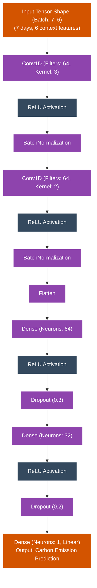

# Carbon CNN Project Architecture

Based on the analysis of your project's `README.md`, `CLAUDE.md`, and Python files, here is the architecture diagram for your **1D CNN Carbon Emission Prediction Pipeline**.

## 1. Complete End-to-End Pipeline Data Flow

The workflow acts chronologically, with each numbered script serving as a layer that consumes inputs from previous steps and drives into the core CNN and final applications.

```mermaid
graph TD
    classDef file fill:#f4d03f,stroke:#333,stroke-width:2px;
    classDef script fill:#1e8449,stroke:#333,stroke-width:2px,color:#fff;
    classDef model fill:#e74c3c,stroke:#333,stroke-width:2px,color:#fff;
    classDef app fill:#2e86c1,stroke:#333,stroke-width:2px,color:#fff;

    subgraph "A. Data Synthesis & EDA"
        d1[city_day.csv]:::file --> s2[02_data_synthesis.py]:::script
        s2 -->|Synthesizes Temp, Industry, Energy| d2[final_df.csv]:::file
        d2 --> s3[03_eda_visualization.py]:::script
        s3 -->|Plots Correlations| d3[eda_results.png]:::file
    end

    subgraph "B. Sequence Prep"
        d2 --> s4[04_data_preprocessing.py]:::script
        s4 -->|Splits into 7-day batches| d4[X/y train & test arrays (.npy)]:::file
        s4 -->|MinMaxScaler State| d5[feature_scaler.save<br/>target_scaler.save]:::file
    end

    subgraph "C. Model Training & XAI"
        d4 --> s5[05_cnn_model.py]:::script
        s5 -->|Checkpoints| m1[best_cnn_model.keras<br/>final_model.keras]:::model
        s5 --> d6[training_history.png]:::file
        
        m1 --> s6[06_model_evaluation.py]:::script
        d4 --> s6
        s6 --> d7[metrics.txt / evaluation plots]:::file
        
        m1 --> s8[08_explainable_ai.py]:::script
        d4 --> s8
        s8 -->|DeepExplainer| d8[shap_values.csv<br/>shap plots]:::file
        
        m1 --> s10[10_baseline_comparison.py]:::script
        s10 --> d9[baseline_metrics.json]:::file
    end

    subgraph "D. Target Applications"
        m1 --> s7[07_streamlit_app.py Dashboard]:::app
        d5 --> s7
        
        m1 --> s9[09_fastapi_server.py REST API]:::app
        d5 --> s9
        s9 -->|swagger/docs| s9t[09_test_api.py IoT Simulator]:::script
    end
```

## 2. 1D CNN Internal Architecture

This represents the tensor transformations happening within `05_cnn_model.py`. The model evaluates 7-day rolling windows across 6 continuous features to predict a single scalar value.


